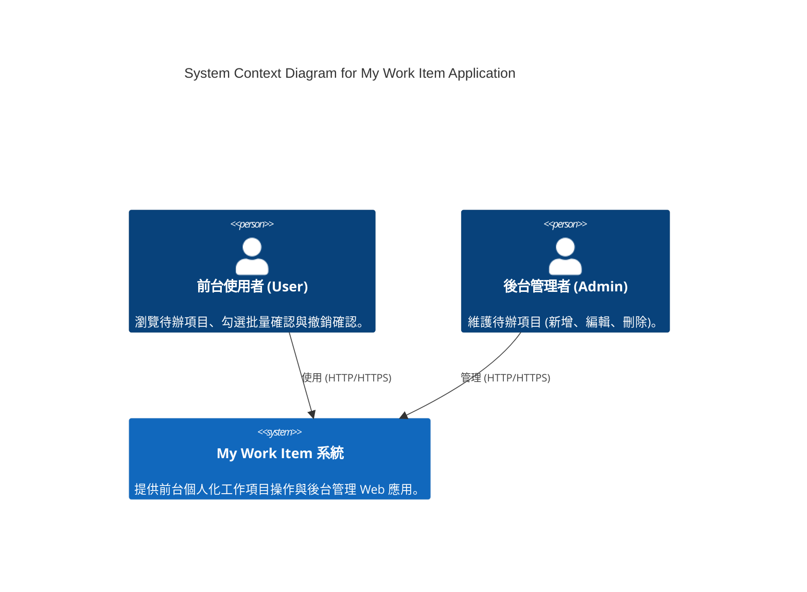

# C4 系統架構圖 (System Architecture Diagrams)

本專案「My Work Item」採用 C4 Model 描述系統環境 (Context) 與容器 (Container) 架構。

本文件描述目前已落地的產品架構。`markitdown/` 為獨立輔助專案，不屬於 My Work Item 產品架構。

## 軟體版本基準

| 軟體 | 版本基準 | 實作狀態 |
| --- | --- | --- |
| Node.js | 20 以上 | 已落地 |
| Next.js | 16 | 已落地 |
| React | 19 | 已落地 |
| Tailwind CSS | 4 | 已落地 |
| TypeScript | 5 | 已落地 |
| .NET SDK / Runtime | 10 | 已落地 |
| PostgreSQL | 16 | 已落地 |
| EF Core / Npgsql | 10 | 已落地 |
| TanStack Query | 5 | 已落地 |
| Docker / Docker Compose | 不鎖定版本 | 已落地 |

架構文件僅記錄主要版本；套件的精確版本以 manifest 與 lockfile 為準。

---

## 1. C4 Context 圖 (系統脈絡圖)

展示前台使用者 (User) 與後台管理者 (Admin) 如何與 My Work Item 全棧系統互動：



---

## 2. C4 Container 圖 (系統容器圖)

展示 Next.js 前端、.NET Web API 後端以及 PostgreSQL 資料庫之間的內部容器與資料流：

```mermaid
C4Container
    title System Container Diagram for My Work Item Application

    Person(user, "前台使用者 (User)", "使用 Web 瀏覽器")
    Person(admin, "後台管理者 (Admin)", "使用 Web 瀏覽器")

    ContainerBoundary(c1, "My Work Item System") {
        Container(frontend, "Next.js Frontend", "Next.js 16, React 19, Tailwind CSS 4", "提供 Web UI、HttpOnly session BFF、TanStack Query 狀態管理與路由防護。")
        Container(backend, ".NET Web API Backend", "C#, .NET 10, EF Core", "提供三層架構 RESTful API、JWT 驗證、Serilog Trace-ID 追蹤與全域 Exception 處理。")
        ContainerDb(database, "PostgreSQL Database", "PostgreSQL 16", "持久化儲存 Users, WorkItems 與 UserWorkItemStatuses 資料。")
    }

    Rel(user, frontend, "訪問 /work-items", "HTTPS")
    Rel(admin, frontend, "訪問 /admin/work-items", "HTTPS")
    Rel(frontend, backend, "呼叫 JSON REST API (帶有 Bearer Token)", "HTTP/REST")
    Rel(backend, database, "讀寫資料 (EF Core / Npgsql)", "TCP / Port 5432")
```
